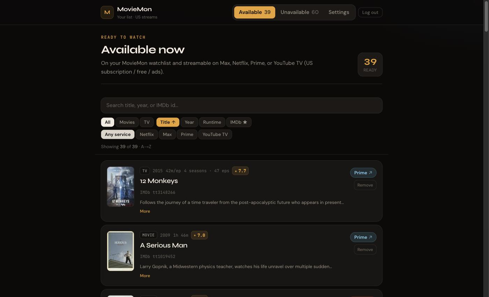
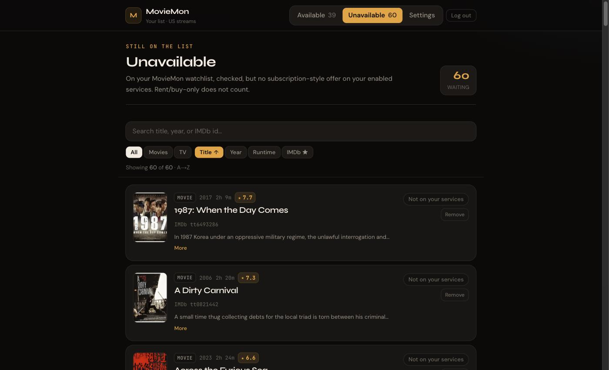
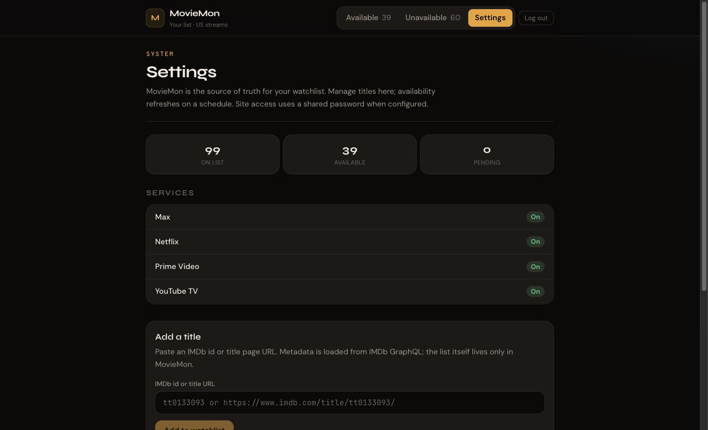

# MovieMon

Self-hosted watchlist that tells you which of your saved titles you can stream **right now** on services you already pay for.

You keep a list of films and shows. Each day a job checks every title against Max, Netflix, Prime Video, and YouTube TV (US), and the site splits the list into **Available now** and **Not available**. No more opening four apps to find out nothing is on.

Built for one household, deployed on Vercel's free tier. Not affiliated with IMDb, Watchmode, or any streaming service.

Design notes: [`docs/plans/watchlist-streaming-availability-v1.md`](docs/plans/watchlist-streaming-availability-v1.md)



## How it works

```text
you add a title (tt… id or IMDb URL)
        │
        ▼
  IMDb GraphQL ──► name, year, poster, plot, rating, runtime
        │
        ▼
   Neon Postgres  ◄── the list lives here, and only here
        │
        ▼
  daily cron ──► Watchmode ──► US offers per provider
        │
        ▼
  Available now  /  Not available
```

Your list is the database, not IMDb. IMDb supplies metadata and an optional one-time CSV import; it is never re-scraped or mirrored.

## Stack

- Next.js (App Router) + TypeScript + Tailwind
- Neon Postgres + Drizzle ORM
- Vercel Cron for the daily availability refresh
- [Watchmode](https://api.watchmode.com/) for streaming offers by IMDb id — the free tier is enough
- IMDb GraphQL for title metadata

## Screens

| | |
|---|---|
| **Unavailable** — still on the list, checked, nothing to watch it on. Rent and buy do not count. | **Settings** — list stats, which services are on, and add a title by IMDb id. |
|  |  |

Search, filter by movie or TV, filter by service, and sort by title, year, runtime, or rating — clicking a sort field again flips the direction.

## Setup

You need Node 20.9+, a Neon database (free), and a Watchmode API key (free).

```bash
git clone https://github.com/huozhe/moviemon.git
cd moviemon
npm install

cp .env.example .env.local   # fill in the values below
npm run db:push              # create tables
npm run seed                 # seed the four providers
npm run dev
```

### Configuration

| Env | Required | Purpose |
|-----|----------|---------|
| `DATABASE_URL` | yes | Neon Postgres connection string |
| `WATCHMODE_API_KEY` | yes | Streaming availability lookups |
| `CRON_SECRET` | yes | Bearer token for cron and manual sync |
| `SITE_PASSWORD` | no | Shared login password. Omit and the site is open — fine locally |
| `AUTH_SECRET` | with `SITE_PASSWORD` | Signs the session cookie. `openssl rand -base64 32` |
| `SYNC_SECRET` | no | Alternate token for `POST /api/sync` |
| `IMDB_WATCHLIST_CSV_URL` | no | Hosted CSV for the one-time import |

## Login

Set `SITE_PASSWORD` and unauthenticated visitors are redirected to `/login`. A signed httpOnly cookie keeps them in for 30 days. There are no user accounts — one password, one household.

`AUTH_SECRET` is deliberately separate from `CRON_SECRET`. The cron token travels through curl commands and shell history, so it must not also be able to mint login sessions.

Failed logins are throttled to 10 per IP per 15 minutes. The counter lives in process memory, so on serverless it is per instance rather than global — pick a strong password and do not treat this as a distributed rate limiter.

Rotating `AUTH_SECRET` invalidates every existing session. Changing `SITE_PASSWORD` alone does not.

## Managing the list

| Action | How |
|--------|-----|
| Add a title | Settings → paste a `tt…` id or IMDb title URL |
| Remove a title | **Remove** on any card (soft-remove; the row is kept) |
| Refresh availability | Daily cron, or `POST /api/sync` with `{"kind":"availability"}` |

### Importing an existing list

Optional, and meant to be done once. Drop exports in [`bootstrap/`](bootstrap/README.md) — the directory is gitignored, because these files are your personal viewing history.

| File | Import with |
|------|-------------|
| `bootstrap/notion_watchlist.md` | `npm run import:notion` (reads the "Want to Watch" section only) |
| `bootstrap/imdb_watchlist.csv` | `POST /api/sync` with `csvText`, or host it and set `IMDB_WATCHLIST_CSV_URL` |

```bash
curl -X POST "$ORIGIN/api/sync" \
  -H "Authorization: Bearer $CRON_SECRET" \
  -H "Content-Type: application/json" \
  -d '{"kind":"watchlist","csvText":"<paste full CSV>"}'
```

Import only ever **adds**. A title you deleted in MovieMon will not come back because it is still in an old export, and a failed import cannot wipe your list.

IMDb answers server-side page fetches with an AWS WAF challenge, so there is no watchlist scraper and there will not be one — export the CSV yourself.

## API

Cron and sync use `Authorization: Bearer $CRON_SECRET`. The watchlist routes use the login cookie when `SITE_PASSWORD` is set.

| Route | Auth | Purpose |
|-------|------|---------|
| `GET /api/cron/sync-availability` | Bearer | Refresh offers — scheduled daily in `vercel.json` |
| `POST /api/sync` | Bearer | Manual sync; `{"kind":"availability"\|"watchlist"\|"both"}` |
| `POST /api/watchlist` | Cookie | Add a title: `{"imdbId":"tt…"}` |
| `DELETE /api/watchlist` | Cookie | Soft-remove a title |

Availability syncs in batches of about 12 titles with a delay between calls, stops cleanly on a Watchmode 429, and keeps whatever progress it made. This keeps a free API key viable.

## Scripts

| Script | Purpose |
|--------|---------|
| `npm run dev` | Dev server |
| `npm run build` | Production build |
| `npm run db:push` | Push schema to Neon |
| `npm run db:generate` / `db:migrate` | Migration workflow |
| `npm run seed` | Seed the four providers |
| `npm run import:notion` | One-time Notion import |

## Deploy

1. Connect the repo to Vercel.
2. Marketplace → **Neon** (free) → injects `DATABASE_URL`.
3. Set `WATCHMODE_API_KEY`, `CRON_SECRET`, and — if you want the site private — `SITE_PASSWORD` plus a distinct `AUTH_SECRET`.
4. Run `db:push` and `seed` against the production database.
5. Import an existing list once, if you have one.
6. Trigger the availability cron manually the first time.

Preview deployments do not inherit `SITE_PASSWORD`, so leave Vercel's Deployment Protection on. Enable git fork protection too if you make your fork public — otherwise a pull request can build with your environment variables.

## Design invariants

Three rules the code is built around. Breaking one is a bug, not a preference.

- **MovieMon owns the list.** Neon is the source of truth. IMDb is metadata and an optional bootstrap, never a mirror.
- **Import never removes.** A CSV import adds and updates. It cannot soft-remove a title missing from the export, and a failed import leaves `on_list` untouched.
- **Available means watchable on a plan you have.** An enabled provider, plus a `flatrate`, `free`, or `ads` offer. Rent and buy do not count.

## Security

One shared password and no user accounts. That is enough to keep a personal list private; it is not a multi-tenant auth system, and it is not trying to be.

- Set `SITE_PASSWORD` and `AUTH_SECRET` together, and keep `AUTH_SECRET` distinct from `CRON_SECRET`.
- Never commit `.env.local` or anything under `bootstrap/`. Both are gitignored — the exports contain your viewing history.
- Keep `next` patched. The auth gate is `proxy.ts`, and a proxy-bypass advisory defeats it outright.

Found a vulnerability? Open an issue. Please do not include a working exploit in the report.

## Status

A personal project, shared because it might be useful. It does what its author needs, and it is single-tenant, US-only, and limited to four providers by design. Issues and pull requests are welcome, but there is no support promise and no roadmap.

## License

[MIT](LICENSE) © Zheng Liu
